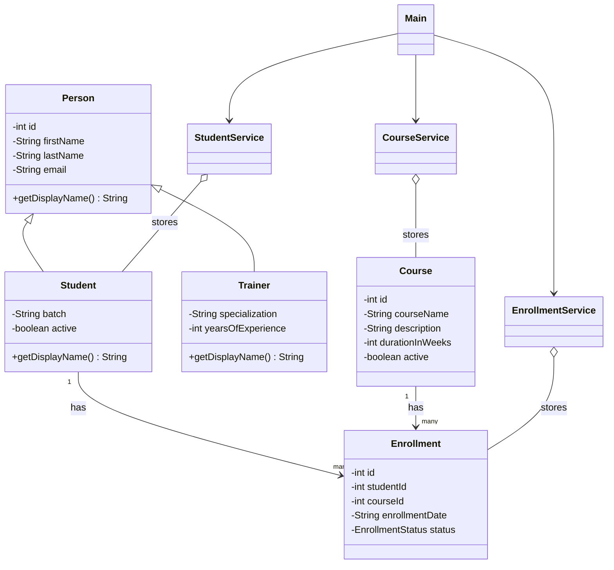

# LearnTrack

LearnTrack is a console-based Student & Course Management System built using Core Java.

The application allows users to:

- Manage students
- Manage courses
- Enroll students in courses
- View student enrollments
- Update enrollment status

The project demonstrates Java fundamentals, object-oriented programming, inheritance, polymorphism, collections, constructors, exception handling, and a menu-driven console interface. Data is stored in memory using `ArrayList`.

## Requirements

- JDK 17 or later

Check the installed Java version:

```powershell
java -version
```

## Compile and Run

Open PowerShell and run each command one at a time.

### 1. Open the project folder

```powershell
cd E:\LearnTracker
```

### 2. Create the build folder

```powershell
New-Item -ItemType Directory -Force .\build
```

This folder stores the compiled `.class` files.

### 3. Find all Java files

```powershell
$sourceFiles = Get-ChildItem .\src -Recurse -Filter *.java | Select-Object -ExpandProperty FullName
```

This command collects all Java source files inside the `src` folder.

### 4. Compile the Java files

```powershell
javac -d .\build $sourceFiles
```

This command compiles the source files and places the compiled files in the `build` folder.

### 5. Run the application

```powershell
java -cp .\build com.airtribe.learntrack.ui.Main
```

This command starts the LearnTrack application. The application displays a menu. Enter `0` to exit.

## Project Structure

```text
src/com/airtribe/learntrack/
├── entity/      Student, Course, Enrollment, Person
├── service/     StudentService, CourseService, EnrollmentService
├── ui/          Main console application
├── exception/   Custom exceptions
└── util/        Utility classes
```

## Class Diagram


